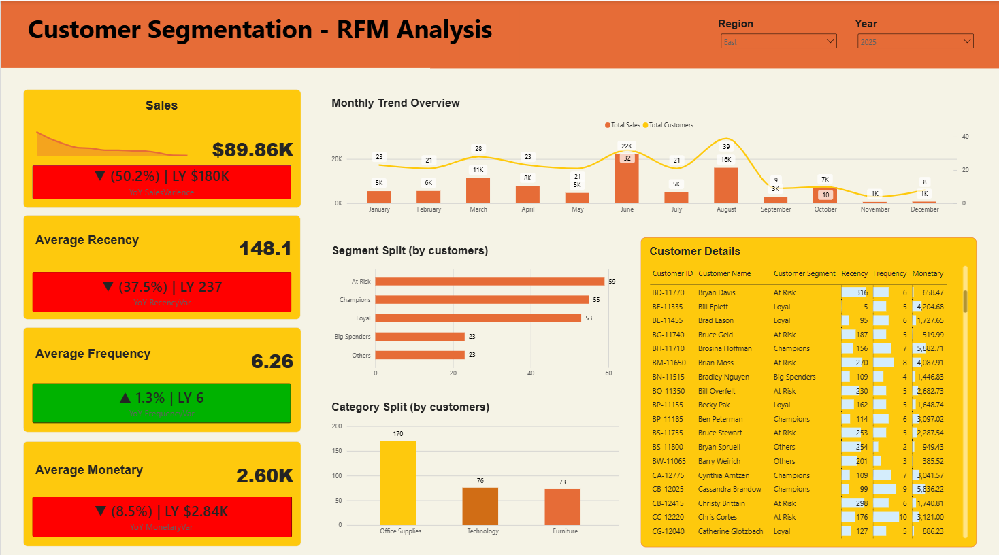

# Customer Segmentation using RFM Analysis

A customer analytics project segmenting customers by purchase behavior using RFM (Recency, Frequency, Monetary) analysis, with behavior-based marketing recommendations and an interactive Power BI dashboard.

## Overview

This project uses a transactional sales dataset, calculates RFM metrics for each customer, segments customers into behavior-based groups (Champions, Loyal, At Risk, and more), analyzes patterns within each segment, and provides targeted marketing recommendations — all visualized in an interactive Power BI dashboard.

- **Customers Analyzed:** 789
- **Total Sales:** $1.97M (Jan 2021 – Dec 2025)
- **Segments:** Champions, Loyal, Big Spenders, At Risk, Others, Lost

## Project Structure

```
├── data/
│   └── superstore_dataset.csv                      # Raw transactional sales dataset
├── docs/
│   ├── data_dictionary                              # Column definitions and descriptions
│   ├── dax_code.md                 # All DAX measures and calculations used
│   ├── segment_behaviour_analysis.md                 # Detailed behavior patterns by segment
│   └── marketing_recommendations.md                  # Targeted recommendations by segment
├── assets/
│   ├── Customer_Segmentation_RFM_Analysis.pbix        # Power BI dashboard file
│   ├── Customer_Segmentation_RFM_Analysis.png         # Dashboard screenshot
│   └── Modal View.png                                # dataset modal view
└── README.md
```

## RFM Methodology

Each customer was scored 1-5 (1 = best, 5 = worst) on three dimensions:
- **Recency** — how recently they last ordered
- **Frequency** — how often they order
- **Monetary** — how much they spend

These scores were combined into six behavior-based segments using DAX logic documented in [docs/customer_segmentation_dax.md](docs/customer_segmentation_dax.md).

## Data Dictionary

Full column-by-column definitions for the dataset are in [docs/data_dictionary](docs/data_dictionary).

## Segment Behavior Analysis

A full breakdown of each segment — who they are, what they buy, and their ordering patterns — is in [docs/segment_behaviour_analysis.md](docs/segment_behaviour_analysis.md).

**Key findings:**
- Champions and At Risk together make up 68% of all sales from just 47% of customers
- At Risk is both the largest segment and the largest revenue pool (37% of sales)
- Furniture is a weak margin category across nearly every segment, and loses money in two of them
- Technology and Office Supplies carry most of the profit

## Marketing Recommendations

Segment-specific targeted recommendations — including priority order, outreach strategy, and timing — are in [docs/marketing_recommendations.md](docs/marketing_recommendations.md).

## Dashboard

The Power BI dashboard visualizes sales trends, segment splits, and customer-level detail, with filters for Region and Year.



**Views included:**
- Sales, Average Recency, Average Frequency, and Average Monetary KPIs with year-over-year variance
- Monthly Trend Overview
- Segment Split by customer count
- Category Split by customer count
- Customer Details table with individual RFM scores

The interactive dashboard file is available at `assets/Customer_Segmentation_RFM_Analysis.pbix` (requires Power BI Desktop to open).

## Tools Used

- **Power BI / DAX** — RFM calculation, segmentation logic, and dashboard visualization